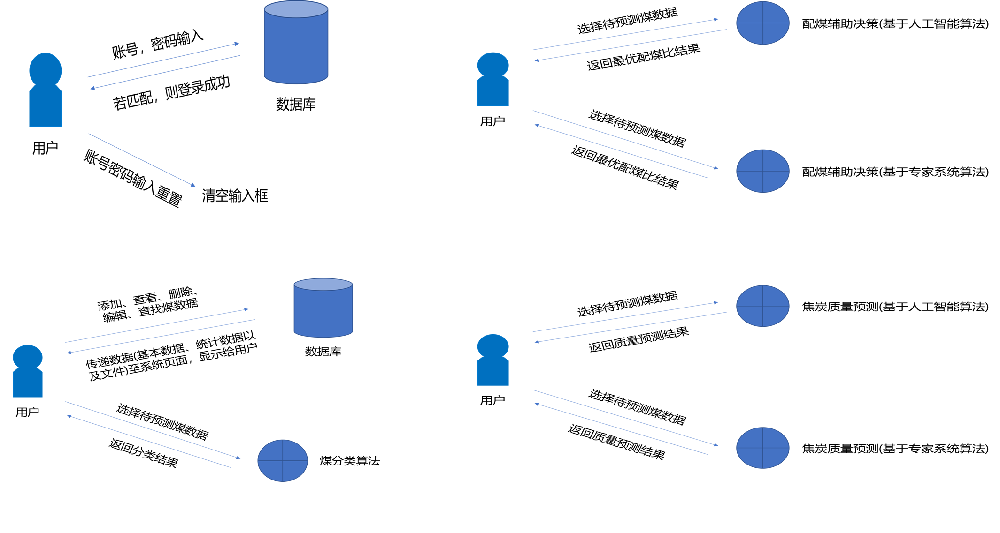
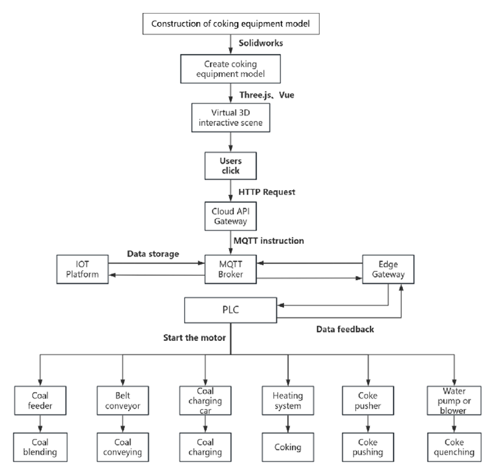

开发者帮助文档
==============

智慧焦化软件是一款面向炼焦厂操作人员和工艺工程师的数字化管控平台，覆盖了 **配煤、输送、装煤、加热炼焦、推焦、熄焦** 全流程设备。用户通过三维数字孪生界面实时监控并一键控制现场 PLC，系统则以秒级闭环将关键数据回写至界面，帮助快速定位异常、降低人工与能耗成本。

.. contents:: 目录
   :local:
   :depth: 2

系统架构（System Architecture）
------------------------------

.. image:: ../_images/developer_documentation/overview_architecture.png
   :alt: 系统架构总览
   :width: 100%

如上图所示，系统由 **边缘层、平台层、应用层** 三部分组成：

* **边缘层**：PLC、变频器与传感器通过 Modbus/TCP 与工控机通信，边缘网关把现场信号转为 MQTT。  
* **平台层**：云端 API（Flask）负责业务逻辑，TimescaleDB 存储时序数据，MinIO 归档文件，RabbitMQ 缓冲异步任务。  
* **应用层**：Vue.js + Three.js 前端渲染 3D 场景并通过 WebSocket 收发实时数据。  

技术框架示意（Framework Diagram）
---------------------------------

.. image:: ../_images/developer_documentation/framework_diagram.png
   :alt: 技术框架
   :width: 100%

* **Vue 3 + Pinia + Three.js** — 数字孪生 UI 与状态管理  
* **Flask / FastAPI** — 提供 REST + WebSocket；后台任务用 Celery  
* **MySQL + TimescaleDB** — 分别存储主数据与高频时序数据  
* **MQTT** — 边云消息通道；QoS1 保证命令必达  
* **TensorFlow / XGBoost** — AI 预测模型服务  

三维模型 / 二维设计（点击标题下载 3D GLB）
--------------------------------------

`配煤 (GLB) <../_static/models/blending.glb>`_
^^^^^^^^^^^^^^^^^^^^^^^^^^^^^^^^^^^^^^^^^^^^^

.. image:: ../_images/developer_documentation/2d/blending_layout.png
   :alt: 配煤流程图 + 3D 视图
   :width: 100%

`输送 (GLB) <../_static/models/conveying.glb>`_
^^^^^^^^^^^^^^^^^^^^^^^^^^^^^^^^^^^^^^^^^^^^^^

.. image:: ../_images/developer_documentation/2d/conveying_layout.png
   :alt: 输送皮带平面 + 3D 视图
   :width: 100%

`装煤 (GLB) <../_static/models/charging.glb>`_
^^^^^^^^^^^^^^^^^^^^^^^^^^^^^^^^^^^^^^^^^^^^^

.. image:: ../_images/developer_documentation/2d/charging_topview.svg
   :alt: 炉顶装煤定位 + 3D 视图
   :width: 100%

`加热 (GLB) <../_static/models/heating.glb>`_
^^^^^^^^^^^^^^^^^^^^^^^^^^^^^^^^^^^^^^^^^^^^

.. image:: ../_images/developer_documentation/2d/heating_section.png
   :alt: 炉体加热剖面 + 3D 视图
   :width: 100%

`推焦 (GLB) <../_static/models/pushing.glb>`_
^^^^^^^^^^^^^^^^^^^^^^^^^^^^^^^^^^^^^^^^^^^^

.. image:: ../_images/developer_documentation/2d/pushing_schedule.svg
   :alt: 推焦调度甘特 + 3D 视图
   :width: 100%

`干熄焦 (GLB) <../_static/models/quenching_dry.glb>`_
^^^^^^^^^^^^^^^^^^^^^^^^^^^^^^^^^^^^^^^^^^^^^^^^^^^^^

.. image:: ../_images/developer_documentation/2d/quenching_flow.png
   :alt: 干熄焦流程 + 3D 视图
   :width: 100%

技术流程（Technical Workflow）
-----------------------------

.. image:: ../_images/developer_documentation/technical_flow.png
   :alt: 技术流程
   :width: 100%

1. **浏览器操作** → Vue 触发 REST 调用  
2. **云端 API** 将指令写入 MQTT Topic  
3. **边缘网关** 订阅 Topic 并下发 PLC  
4. **PLC** 驱动电机 / 阀门 → 现场执行  
5. **实时数据** 经网关上传 TimescaleDB；WebSocket 推送至前端  

用例图（Use Case Diagram）
--------------------------

**Actor**

* *操作员* — 通过数字孪生界面控制 / 监控设备  
* *工艺工程师* — 分析质量数据并调整配煤策略  
* *维保人员* — 接收告警并执行维护工单  

**核心用例**

* *启动 / 停止设备* — 对单台或批量设备下达启停指令  
* *调整工艺参数* — 修改配煤比例、炉温设定等关键参数  
* *实时监控* — 在 3D 场景中查看运行状态与传感器数据  
* *异常告警* — 实时弹窗并推送至移动端  
* *数据报表* — 导出生产统计与能耗分析  

系统数据流（System Data Flow）
------------------------------

+--------+------------------------------------------+
| 序号   | 描述                                     |
+========+==========================================+
| 1      | **用户输入** — Vue 发送 API              |
+--------+------------------------------------------+
| 2      | **命令下发** — Flask→MQTT                |
+--------+------------------------------------------+
| 3      | **设备执行** — PLC→现场                  |
+--------+------------------------------------------+
| 4      | **数据回传** — 传感器→DB                 |
+--------+------------------------------------------+
| 5      | **界面刷新** — WebSocket                 |
+--------+------------------------------------------+

主要技术栈
--------

前端：Vue.js
~~~~~~~~~~~~
* **Three.js 可视化** — 数字孪生 3D 模型  
* **Pinia 状态管理** — 替代 Vuex，轻量响应式  
* **Vue-Router** — 单页导航  

后端：Python & Flask
~~~~~~~~~~~~~~~~~~~~
* **REST / WebSocket** — 同步命令 + 实时推送  
* **SQLAlchemy** — ORM 访问 MySQL  
* **Celery + Redis** — 异步任务与调度  

数据库：MySQL & TimescaleDB
~~~~~~~~~~~~~~~~~~~~~~~~~~
* **MySQL** — 业务主数据（用户、设备表）  
* **TimescaleDB** — 毫秒级时序数据（温度、压力、电流）  

消息与边缘
~~~~~~~~~~
* **MQTT** — QoS1，主题粒度到设备 / 点位  
* **EdgeX Foundry** — 设备虚拟化与协议适配  

关键特性
--------
* **秒级闭环** — 操作 → 执行 → 反馈 < 2 s  
* **热插拔模型** — AI 服务与业务解耦，可独立升级  
* **高可用** — 双实例 Flask + MySQL 主从 + TimescaleDB 流复制  

扩展与维护
----------
* **模块化部署** — Docker Compose 一键拉起；生产可切换 Kubernetes  
* **CI/CD** — GitHub Actions 自动测试、打包与推镜像  
* **可观测性** — Prometheus + Grafana 监控 API 延迟与设备在线率  
